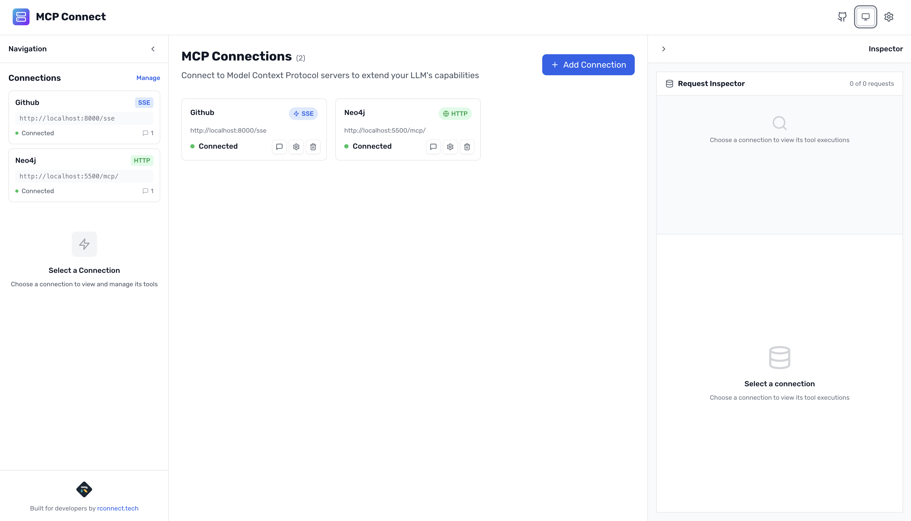
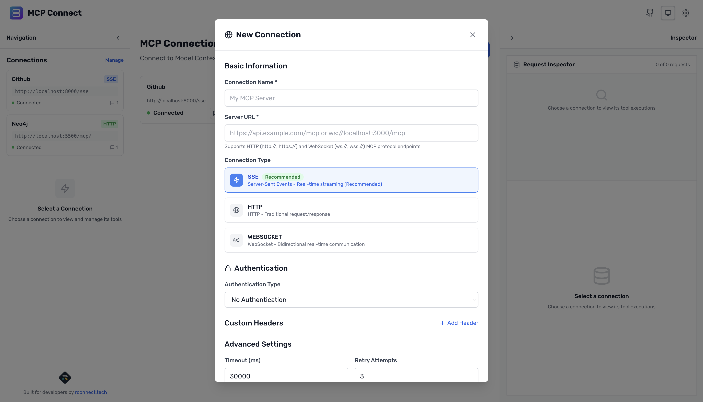
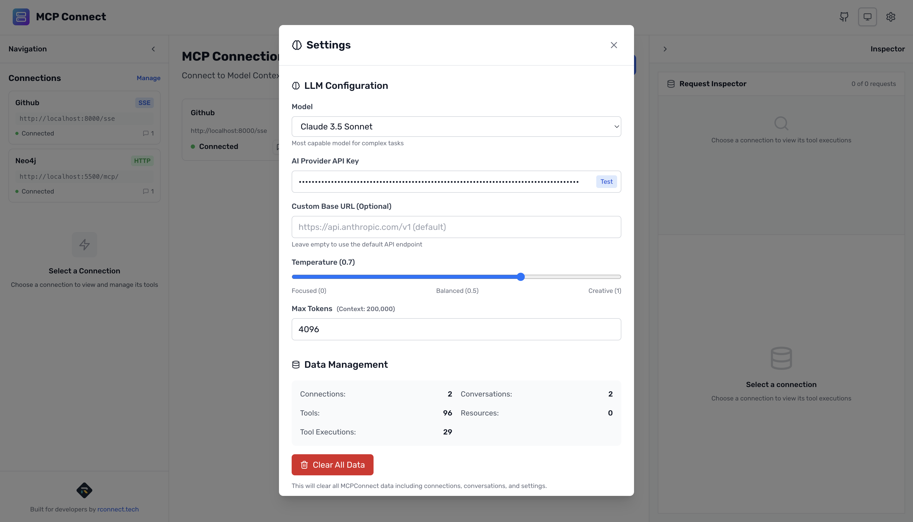
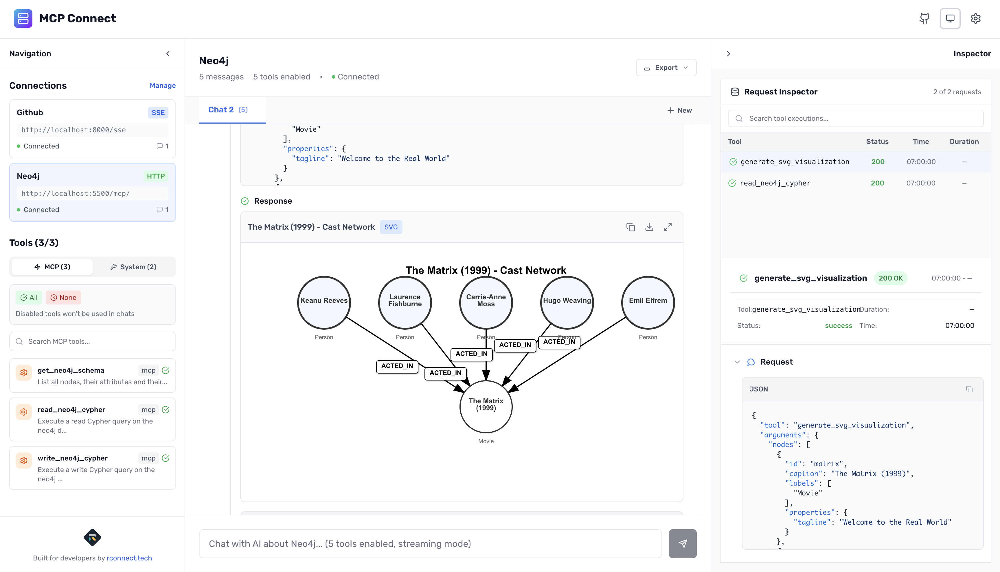

# MCP Connect

<div align="center">
  <picture>
    <source srcset="./docs/mcpconnect-github-ui-dark.png" media="(prefers-color-scheme: dark)">
    
  </picture>
  <p><a href="https://mcp.rconnect.tech" target="_blank" rel="noopener noreferrer">mcp.rconnect.tech</a></p>
</div>

Professional browser-based development environment for Model Context Protocol (MCP) debugging and development. MCP Connect provides visual protocol inspection, real-time tool testing, and seamless AI integration for building robust MCP applications.

## Overview

MCP Connect is a comprehensive development workbench that bridges the gap between MCP servers and AI language models. It transforms MCP development from a command-line experience into a visual, interactive workflow that accelerates debugging and reduces integration complexity.

<div align="center">
  <picture>
    <source srcset="./docs/mcpconnect-home-ui-dark.png" media="(prefers-color-scheme: dark)">
    
  </picture>
  <p><em>Clean, intuitive interface for MCP development and testing</em></p>
</div>

### Core Value Proposition

**For MCP Developers**: Eliminate the trial-and-error cycle of MCP development with visual debugging, real-time protocol inspection, and integrated tool testing.

**For AI Engineers**: Test and validate MCP tool integrations before production deployment, ensuring reliable AI-tool interactions.

**For System Architects**: Understand MCP protocol flows and optimize tool performance with detailed execution analytics.

## Key Features

### Protocol-First Development

MCP Connect provides native support for HTTP, WebSocket, and Server-Sent Events protocols, enabling developers to work with any MCP server regardless of transport implementation. Real-time protocol message monitoring captures every request and response with visual formatting, making it simple to understand complex protocol flows. The centralized connection management system handles multiple MCP server environments simultaneously, while automatic tool and resource enumeration discovers available capabilities without manual configuration.

<div align="center">
  <picture>
    <source srcset="./docs/mcpconnect-add-connection-ui-dark.png" media="(prefers-color-scheme: dark)">
    
  </picture>
  <p><em>Simple MCP server connection configuration with support for multiple protocols</em></p>
</div>

### Visual Debugging Environment

The interactive tool browser presents a sidebar-based interface for managing available tools with intuitive enable/disable controls. Detailed execution logs capture timing, parameters, and results for every tool invocation, providing the insights needed for performance optimization and error diagnosis. Complete conversation history tracking maintains timelines of tool interactions within chat contexts, and comprehensive export capabilities allow conversations to be saved in multiple formats for documentation and team collaboration.

### AI Integration Layer

Flexible AI provider support accommodates both Anthropic Claude and OpenAI models with fully configurable parameters for temperature, token limits, and model selection. Real-time streaming responses provide immediate feedback while visualizing tool execution progress, creating a natural development workflow. Intelligent conversation context management optimizes token usage while maintaining conversational coherence, and dynamic tool state management enables or disables tools based on conversation requirements and performance considerations.

<div align="center">
  <picture>
    <source srcset="./docs/mcpconnect-add-llm-ui-dark.png" media="(prefers-color-scheme: dark)">
    
  </picture>
  <p><em>Flexible AI provider setup with support for multiple models and custom parameters</em></p>
</div>

### Developer Experience

Zero-configuration startup through the npx command eliminates setup friction and gets developers testing immediately. Local browser storage ensures all conversation data and configurations remain private with no external dependencies or data transmission. TypeScript-native implementation provides complete type safety with comprehensive schema definitions for all MCP protocol elements, while the included React component library enables rapid development of custom MCP-enabled applications.

<div align="center">
  <picture>
    <source srcset="./docs/mcpconnect-add-svg-ui-dark.png" media="(prefers-color-scheme: dark)">
    
  </picture>
  <p><em>Built-in SVG generation capabilities for dynamic visualizations</em></p>
</div>

## Feature Matrix

| Feature                      | Status       | Description                                          |
| ---------------------------- | ------------ | ---------------------------------------------------- |
| **Instant CLI Access**       | ✅ Available | Zero-install launch with `npx @mcpconnect/cli`       |
| **Free Web Access**          | ✅ Available | No-signup usage at mcp.rconnect.tech                 |
| **Protocol Support**         | ✅ Available | HTTP, WebSocket, Server-Sent Events                  |
| **Automatic Tool Discovery** | ✅ Available | Auto-enumeration of tools and capabilities           |
| **Multi-LLM Support**        | ✅ Available | Anthropic Claude, OpenAI GPT models                  |
| **Multiple Connections**     | ✅ Available | Manage multiple MCP servers simultaneously           |
| **Request Rate Limiting**    | ✅ Available | Built-in rate limiting with configurable thresholds  |
| **Context Warnings**         | ✅ Available | Token usage warnings and conversation length alerts  |
| **Fast Tool Enable/Disable** | ✅ Available | One-click tool management with bulk operations       |
| **SVG Graph Generation**     | ✅ Available | Dynamic visualization generation with built-in tools |
| **Chat Export**              | ✅ Available | Multiple formats: JSON, Markdown, Plain text         |
| **Network Inspector**        | ✅ Available | Real-time protocol message inspection                |
| **Streaming Responses**      | ✅ Available | Real-time AI response streaming                      |
| **Composable Components**    | ✅ Available | Reusable React components for custom applications    |
| **Local Data Storage**       | ✅ Available | Browser-based storage with compression               |
| **TypeScript Support**       | ✅ Available | Full type safety and schema validation               |
| **Custom Prompts**           | 🚧 Pending   | User-defined prompt templates and management         |
| **Resource Browser**         | 🚧 Pending   | Visual interface for MCP resource exploration        |

## Quick Start

Launch MCP Connect in under 30 seconds:

```bash
npx @mcpconnect/cli
```

This command starts the development server and opens the browser interface with no installation required.

## Installation Options

### Command Line Interface

```bash
# One-time execution
npx @mcpconnect/cli

# Global installation
npm install -g @mcpconnect/cli
mcpconnect
```

## Technical Architecture

MCP Connect is built as a modular TypeScript monorepo optimized for developer productivity. The core packages include the command-line interface for zero-config setup, an Express-based development server with integrated UI, a React frontend application with TypeScript, and a comprehensive library of reusable UI components.

The adapter layer provides abstraction for AI providers through the Vercel AI SDK, browser storage capabilities with compression support, and core adapter interfaces with utilities for extending functionality. Comprehensive TypeScript definitions ensure type safety across the entire MCP protocol with dedicated schemas for chat conversations and tool execution tracking.

## Configuration Guide

### MCP Server Connection

Navigate to the connection management interface and configure your server endpoint using any supported protocol (http://, https://, ws://, wss://). Set the appropriate authentication parameters including Bearer tokens, API keys, or Basic authentication credentials. Test the connection to verify functionality and confirm that tools are properly discovered. Enable the specific tools required for your testing workflow through the visual interface.

### AI Provider Setup

Access the settings panel from the application header and configure your AI provider credentials for either Anthropic Claude or OpenAI models. Select your preferred model and adjust generation parameters including temperature, token limits, and streaming preferences. Validate API connectivity through the built-in testing function and configure streaming settings based on your development requirements.

## Use Cases

### MCP Server Development

Test tool implementations during active development cycles to catch issues early and validate protocol compliance with comprehensive error handling verification. Debug complex tool interactions using detailed execution logging that captures timing, parameters, and results. Verify authentication and authorization flows work correctly across different security configurations and user contexts.

### AI Application Development

Test AI-tool integrations thoroughly before production deployment to ensure reliable operation under various conditions. Optimize tool selection and conversation flows by analyzing usage patterns and performance metrics. Validate tool parameter handling and error scenarios to build robust applications that gracefully handle edge cases and failures.

### Protocol Analysis

Understand MCP message flows and timing characteristics through real-time protocol inspection and detailed logging. Analyze tool usage patterns across multiple conversations to identify optimization opportunities and common failure modes. Debug protocol-level issues with comprehensive inspection capabilities that reveal low-level communication details, and document tool capabilities and limitations for team knowledge sharing.

## Performance Characteristics

### Frontend Optimization

The application maintains a bundle size under 2MB through intelligent code splitting and lazy loading of non-critical components. Efficient virtual scrolling handles large conversation histories without performance degradation, while optimized React rendering patterns minimize unnecessary re-renders during active development sessions.

### Data Management

Compressed local storage with configurable limits ensures efficient data usage while maintaining fast access to conversation history and tool execution logs. Efficient indexing systems for conversations and tool executions enable quick searches and filtering. Background cleanup processes remove expired data automatically, and the minimal memory footprint supports long-running development sessions without browser performance issues.

### Network Efficiency

Connection pooling manages multiple MCP server connections simultaneously with intelligent retry logic and exponential backoff for handling temporary network issues. Streaming support provides real-time response feedback while optimized protocol message handling reduces bandwidth usage during intensive debugging sessions.

## Browser Compatibility

### Minimum Requirements

- ES2020+ JavaScript support
- WebSocket API implementation
- Server-Sent Events capability
- localStorage with 10MB+ capacity
- Fetch API with CORS support

## Security Model

### Data Privacy

- All conversation data stored locally in browser
- No external data transmission to MCP Connect infrastructure
- Configurable data retention policies
- Optional conversation encryption

### Network Security

- HTTPS/WSS recommended for production connections
- Configurable CORS policies for development
- API key management with secure storage
- Certificate validation for secure connections

## Development Workflow

The typical development cycle begins with launching MCP Connect and configuring connections to your MCP server endpoints. Review the automatically discovered tools and resources to understand available capabilities. Enable specific tools for testing and validate individual functionality before moving to integration testing. Test AI conversations that utilize your tools to verify end-to-end workflows, then use the inspector panel to analyze detailed execution logs and optimize performance.

The debugging capabilities include real-time protocol message inspection that captures every communication detail, comprehensive tool execution timing and performance metrics, error tracking with complete stack trace analysis, and conversation export functionality for sharing debugging information with team members.

## Troubleshooting

### Connection Issues

Verify that your MCP server is accessible and properly configured for CORS if running in a browser environment. Confirm that authentication credentials are correct and have appropriate permissions for the tools you're attempting to access. Test with HTTP endpoints before attempting WebSocket or Server-Sent Events protocols, and check for network connectivity issues or firewall restrictions that might block the connection.

### Tool Execution Problems

Validate that tool parameters match the expected schema defined by your MCP server implementation. Review the tool enablement status in the sidebar interface to ensure required tools are active for your conversation. Analyze detailed execution logs available in the inspector panel to identify specific failure points, and verify that your AI provider is properly configured with valid API credentials and sufficient usage limits.

### Performance Issues

Monitor browser memory usage during extended development sessions and clear conversation history periodically to maintain optimal performance. Adjust streaming settings based on your network conditions and connection stability. Use the export functionality to archive older conversations and free up browser storage space for active development work.

## Contributing

We welcome contributions to MCP Connect development:

### Development Setup

```bash
git clone https://github.com/rocket-connect/mcpconnect.git
cd mcpconnect
pnpm install
pnpm run dev
```

### Contribution Guidelines

- Follow existing TypeScript patterns and conventions
- Include comprehensive tests for new functionality
- Update documentation for API changes
- Ensure browser compatibility across supported platforms

### Issue Reporting

- Use GitHub Issues for bug reports and feature requests
- Provide detailed reproduction steps and environment information
- Include relevant console logs and error messages
- Suggest solutions or workarounds when possible

## License

MIT License - see [LICENSE](LICENSE) file for complete terms.

<div align="center">
  <picture>
     
  </picture>
  <p>Built by <a href="https://rconnect.tech" target="_blank" rel="noopener noreferrer">rconnect.tech</a> - Advancing professional AI development tools. </p>
</div>
