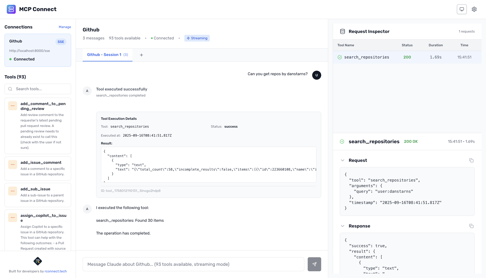
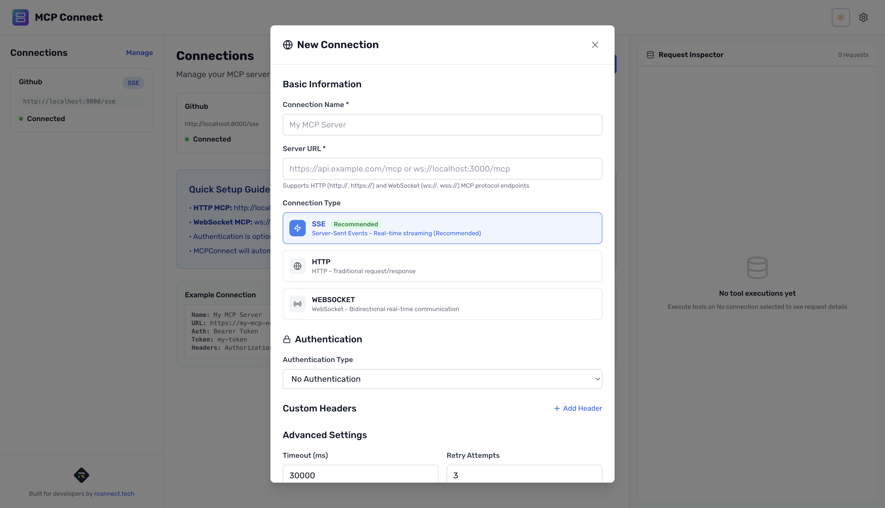
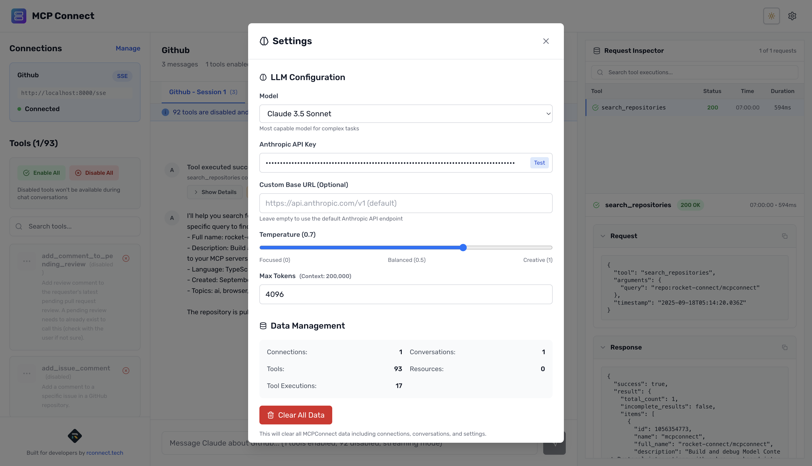

# MCP Connect

<div align="center">

**Build and debug Model Context Protocol integrations with a browser-based interface that connects directly to your MCP servers.**

[](https://opensource.org/licenses/MIT)
[](https://nodejs.org/)
[](https://www.typescriptlang.org/)
[](https://reactjs.org/)

[🚀 Live Demo](https://mcp.rconnect.tech) • [📖 Documentation](https://docs.claude.com) • [💬 Community](https://github.com/rocket-connect/mcpconnect/discussions)

</div>

## Overview

<div align="center">
  
</div>

MCP Connect is a developer-focused tool for testing and debugging Model Context Protocol (MCP) servers. It provides a visual interface to connect to MCP servers, explore their tools and resources, and interact with them through conversational AI.

**🎯 Perfect for:** MCP server developers, AI application builders, and teams integrating Claude or other LLMs with custom tools.

## 🌟 Key Features

| Feature                              | Description                                                               |
| ------------------------------------ | ------------------------------------------------------------------------- |
| **🔌 Direct MCP Protocol Support**   | WebSocket, HTTP, and SSE transport using standard MCP protocols           |
| **🛠️ Visual Tool Testing**           | Interactive forms for tool execution with real-time feedback              |
| **🤖 Conversational AI Integration** | Connect your own OpenAI or Anthropic API keys for chat-based interactions |
| **🔍 Request Inspector**             | Debug protocol messages, monitor performance, and track executions        |
| **🌐 Zero Configuration**            | Works entirely in the browser with no server-side dependencies            |

## 🚀 Quick Start

Get up and running in under 30 seconds:

```bash
npx @mcpconnect/cli
```

This opens MCP Connect at `http://localhost:3001` with a complete debugging environment.

## 💻 Developer Workflow

<div align="center">
  <table>
    <tr>
      <td width="50%">
        
        <h4 align="center">🔗 Connection Setup</h4>
        <p align="center">Easily connect to any MCP server with authentication support</p>
      </td>
      <td width="50%">
        
        <h4 align="center">🧠 LLM Configuration</h4>
        <p align="center">Connect your Claude or OpenAI API keys for AI-powered interactions</p>
      </td>
    </tr>
  </table>
</div>

MCP Connect streamlines MCP server development:

1. **🏗️ Start your MCP server** on any port with any transport
2. **🚀 Run MCP Connect** to launch the debugging interface
3. **🔍 Connect and introspect** - automatically discover tools and resources
4. **🧪 Test tools visually** with form-based parameter input
5. **🐛 Debug with inspector** - view raw protocol messages and performance metrics

## 🛠️ Installation Options

### 🌐 Online (No Installation)

Visit **[mcp.rconnect.tech](https://mcp.rconnect.tech)** to use MCP Connect directly in your browser.

### ⚡ CLI (Recommended for Local Development)

```bash
npx @mcpconnect/cli
```

### 🔧 Self-hosted

```bash
git clone https://github.com/rocket-connect/mcpconnect
cd mcpconnect
pnpm install && pnpm build
pnpm start
```

## 🔌 Supported Protocols

| Protocol               | Description                             | Status    |
| ---------------------- | --------------------------------------- | --------- |
| **HTTP**               | Standard request/response MCP over HTTP | ✅ Stable |
| **Server-Sent Events** | Streaming MCP responses (recommended)   | ✅ Stable |
| **WebSocket**          | Bidirectional real-time communication   | 🚧 Beta   |

**Authentication supported:** Bearer tokens, API keys, Basic auth, custom headers.

## 🤖 LLM Integration

MCP Connect supports multiple LLM providers with your own API keys:

| Provider             | Models                      | Status          |
| -------------------- | --------------------------- | --------------- |
| **Anthropic Claude** | 3.5 Sonnet, 3 Opus, 3 Haiku | ✅ Full Support |
| **OpenAI**           | GPT-4, GPT-3.5              | 🚧 Coming Soon  |
| **Local Models**     | OpenAI-compatible endpoints | 🚧 Coming Soon  |

Configure your API key in the settings panel to enable conversational interactions with discovered MCP tools.

## 🔧 Configuration

MCP Connect stores configuration in browser localStorage:

- **🔗 Connections** - MCP server endpoints and authentication
- **🤖 LLM Settings** - API keys and model preferences
- **🎨 UI State** - Theme, layout preferences
- **📊 Tool Executions** - Request/response history for debugging

## 🛡️ Security & Privacy

- **🔒 Local-first** - All data stored in your browser
- **🚫 No telemetry** - We don't track your usage
- **🔐 API keys** - Stored locally, never sent to our servers
- **🌐 CORS-friendly** - Works with any MCP server configuration

## 📄 License

MIT License - see [LICENSE](LICENSE) for details.

---

<div align="center">

**Built with ❤️ by [rconnect.tech](https://rconnect.tech)**

_Connecting developers through open source tools_

</div>
