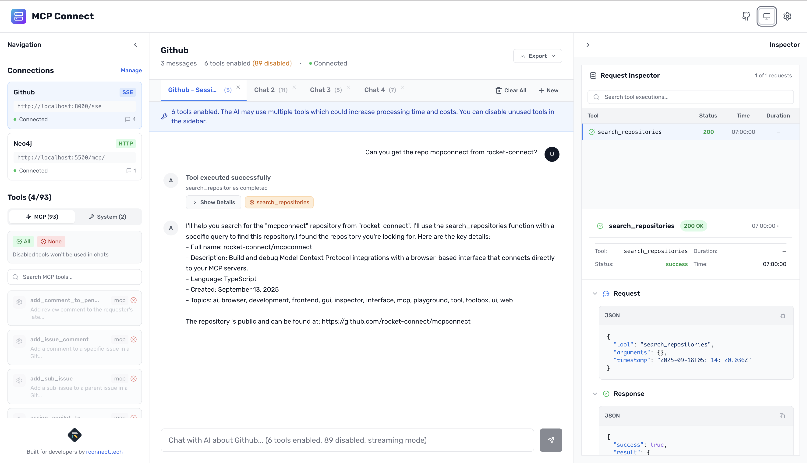

# MCP Connect

<div align="center">
  <picture>
    <source srcset="./docs/mcpconnect-github-ui-dark.png" media="(prefers-color-scheme: dark)">
    
  </picture>
  <p><a href="https://mcp.rconnect.tech" target="_blank" rel="noopener noreferrer">mcp.rconnect.tech</a></p>
</div>

Browser-based development environment for debugging and testing Model Context Protocol (MCP) servers.

**Integration Guides:**

- → [How to connect to the Supabase MCP server](https://www.rconnect.tech/blog/how-to-mcp-connect-supabase)
- → [How to connect to the GitHub MCP server](https://www.rconnect.tech/blog/how-to-mcp-connect-github)
- → [How to connect to the Neo4j MCP server](https://www.rconnect.tech/blog/how-to-mcp-connect-neo4j)
- → [Semantic Tool Selection with MCP Connect](https://www.rconnect.tech/blog/semantic-tool-selection-guide)

## Quick Start

```bash
npx @mcpconnect/cli@latest
```

Opens browser!

## What It Does

- **Connect** to any MCP server (HTTP, WebSocket, SSE)
- **Test** tools with Claude or OpenAI models
- **Debug** with protocol inspection
- **Control** which tools are enabled to save tokens
- **Export** conversations in JSON/Markdown

**Good for developers:**

- Iterate quickly on tool development
- Execute tools manually from tool page
- Test changes without restarting clients

## License

MIT - see [LICENSE](LICENSE)

<div align="center">
  <p>Built by <a href="https://rconnect.tech">rconnect.tech</a></p>
</div>
